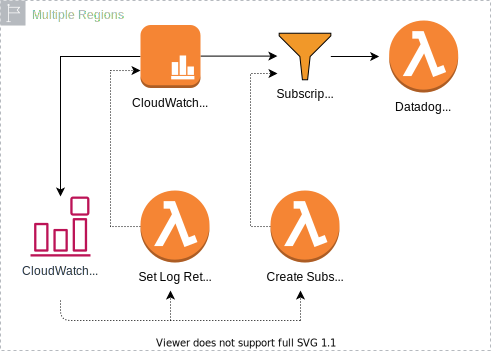

# Terraform: Datadog Forwarder with Cloudwatch Subscription & Retention Lambdas

Deploys the [datadog forwarder](https://docs.datadoghq.com/serverless/forwarder/) and automatic log group subscription and retention policy lambdas across multiple AWS regions. Useful for capturing lambda@edge log groups generated just in time in multiple edge locations.



When a new cloudwatch log group is created the [log-subscription](lambdas/log-subscription/function/index.js) lambda subscribes it to the datadog forwarder and the [log-retention](lambdas/log-retention/function/index.js) lambda sets the retention time to 14 days.

## Usage

Copy example.tfvars and set the name of your datadog API key in secrets manager (last part of the ARN). Make sure this secret is replicated to all regions you are deploying to.

Auth with AWS and import the session into the environment.

Init terraform with the [state S3 bucket](https://www.terraform.io/docs/language/settings/backends/s3.html) for your account.

```
export TF_CLI_ARGS_init='-backend-config="bucket=my-terraform-state-bucket"'
terraform init
```

Run terraform plan, verify the changes to be made, and then apply.

```
terraform plan -var-file="<environment>.tfvars"
terraform apply -var-file="<environment>.tfvars"
```
